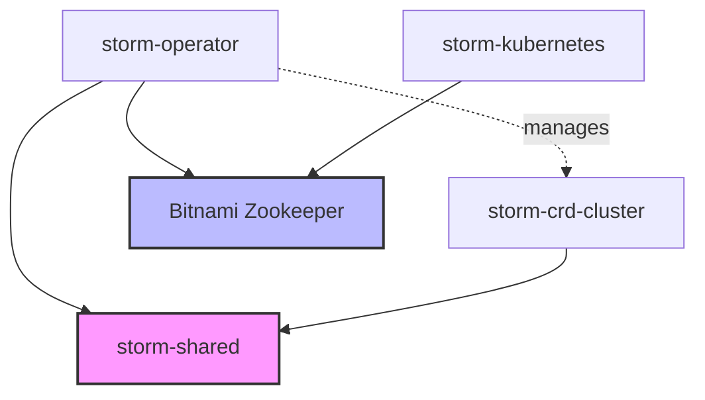
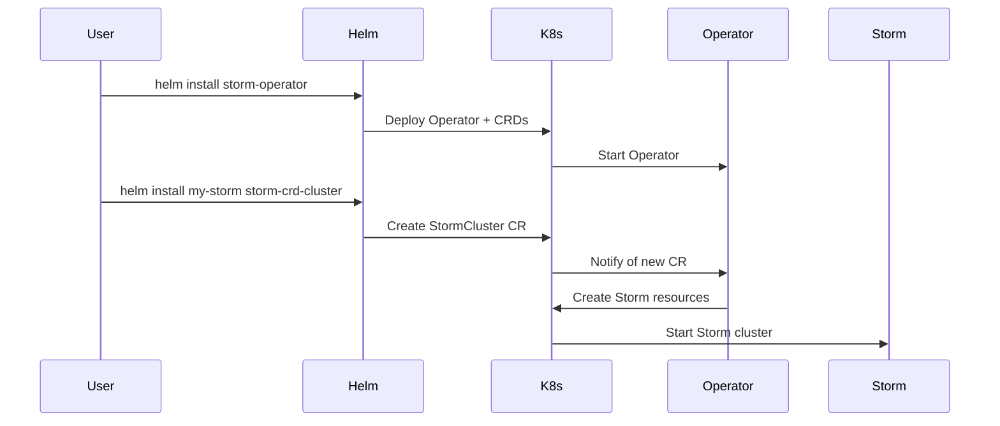
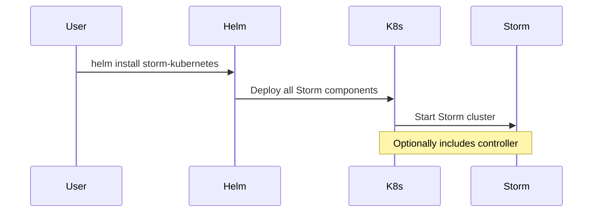
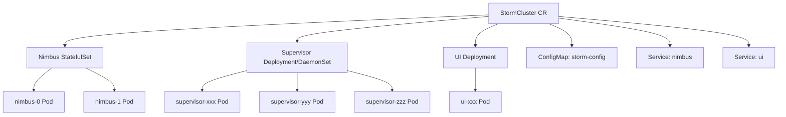
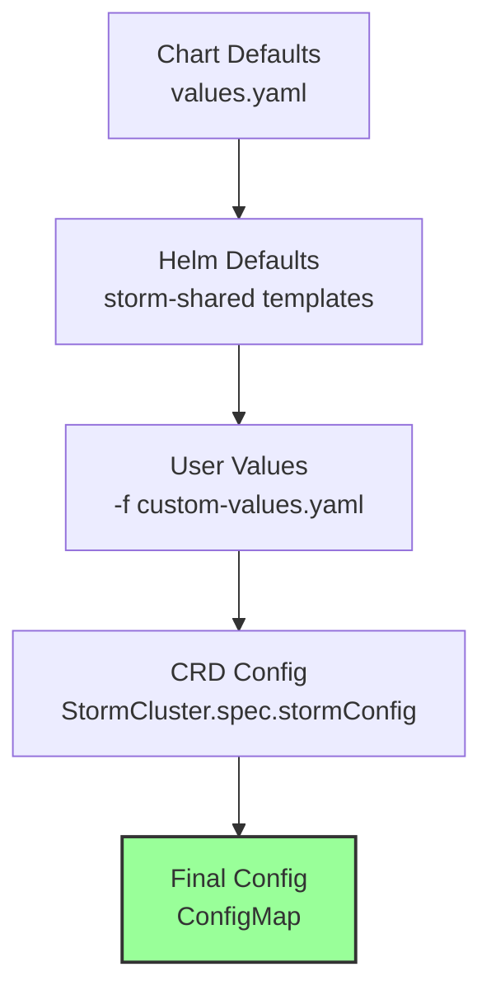

# Helm Chart Architecture

## Overview

The Storm Controller project provides three Helm charts that work together to deploy and manage Apache Storm on Kubernetes:

1. **storm-operator** - The Storm Operator that manages Storm clusters via CRDs
2. **storm-crd-cluster** - Creates StormCluster CRs for the operator to manage
3. **storm-kubernetes** - Traditional all-in-one Storm deployment (legacy)

## Chart Dependencies



### storm-shared Chart

A library chart that provides:
- Common template helpers (`_helpers.tpl`)
- Image management templates (`_images.tpl`)
- Security context templates (`_security.tpl`)
- Shared CRD definitions

## Deployment Patterns

### Pattern 1: Operator-Based Deployment (Recommended)



**Advantages:**
- Declarative cluster management
- Operator handles lifecycle
- Easy multi-cluster support
- GitOps friendly

**Example:**
```bash
# Step 1: Install operator
helm install storm-operator ./charts/storm-operator \
  --namespace storm-system \
  --create-namespace \
  -f values-production.yaml

# Step 2: Deploy Storm cluster
helm install prod-storm ./charts/storm-crd-cluster \
  --namespace storm-system \
  -f storm-production-values.yaml
```

### Pattern 2: Traditional Deployment (Legacy)



**Use Cases:**
- Simple deployments
- Backward compatibility
- Testing and development

**Example:**
```bash
helm install storm ./charts/storm-kubernetes \
  --namespace storm-system \
  --create-namespace \
  --set controller.enabled=true
```

## Chart Configurations

### storm-operator Configuration

```yaml
# Core operator settings
operator:
  replicaCount: 3  # HA deployment
  image:
    repository: storm-operator
    tag: latest
  
  # Resource management
  resources:
    requests:
      cpu: 500m
      memory: 512Mi
    limits:
      cpu: 2000m
      memory: 2Gi

# Zookeeper deployment
zookeeper:
  enabled: true
  replicaCount: 3
  persistence:
    enabled: true
    size: 10Gi

# CRD installation
crd:
  install: true
  annotations:
    "helm.sh/resource-policy": keep

# Monitoring
metrics:
  enabled: true
  serviceMonitor:
    enabled: true
```

### storm-crd-cluster Configuration

```yaml
# Storm cluster specification
storm:
  image:
    repository: storm
    tag: 2.8.1
  
  # Storm configuration (storm.yaml)
  config:
    nimbus.seeds: ["nimbus-0", "nimbus-1"]
    supervisor.slots.ports: [6700, 6701, 6702, 6703]

# Component sizing
nimbus:
  replicas: 2
  resources:
    requests:
      cpu: 1000m
      memory: 2Gi

supervisor:
  replicas: 3
  slotsPerSupervisor: 4
  resources:
    requests:
      cpu: 2000m
      memory: 4Gi

ui:
  enabled: true
  resources:
    requests:
      cpu: 250m
      memory: 512Mi

# Zookeeper reference
zookeeper:
  external:
    enabled: false
  default:
    enabled: true
    operatorNamespace: "storm-system"
```

## Resource Generation

### StormCluster CR Structure

The storm-crd-cluster chart generates:

```yaml
apiVersion: storm.apache.org/v1beta1
kind: StormCluster
metadata:
  name: {{ include "storm-crd-cluster.fullname" . }}
  namespace: {{ .Release.Namespace }}
spec:
  managementMode: create  # Operator creates resources
  image:
    repository: {{ .Values.storm.image.repository }}
    tag: {{ .Values.storm.image.tag }}
  
  nimbus:
    replicas: {{ .Values.nimbus.replicas }}
    resources: {{ toYaml .Values.nimbus.resources | nindent 6 }}
  
  supervisor:
    replicas: {{ .Values.supervisor.replicas }}
    slotsPerSupervisor: {{ .Values.supervisor.slotsPerSupervisor }}
    resources: {{ toYaml .Values.supervisor.resources | nindent 6 }}
  
  ui:
    enabled: {{ .Values.ui.enabled }}
    resources: {{ toYaml .Values.ui.resources | nindent 6 }}
  
  stormConfig: {{ toYaml .Values.storm.config | nindent 4 }}
  
  zookeeper:
    {{- if .Values.zookeeper.external.enabled }}
    servers: {{ toYaml .Values.zookeeper.external.servers | nindent 6 }}
    {{- else }}
    servers:
      - "{{ .Values.zookeeper.default.serviceName }}.{{ .Values.zookeeper.default.operatorNamespace }}.svc.cluster.local"
    {{- end }}
```

### Resources Created by Operator

When the operator processes a StormCluster CR:



## Configuration Hierarchy

The configuration follows a hierarchical merge pattern:



**Merge Order (lowest to highest priority):**
1. Chart default values
2. Shared template defaults
3. User-provided values
4. CRD-specific configuration

## Security Architecture

### RBAC Configuration

```yaml
# Operator ClusterRole
apiVersion: rbac.authorization.k8s.io/v1
kind: ClusterRole
metadata:
  name: storm-operator
rules:
  # CRD management
  - apiGroups: ["storm.apache.org"]
    resources: ["stormclusters", "stormtopologies", "stormworkerpools"]
    verbs: ["*"]
  
  # Core resources
  - apiGroups: [""]
    resources: ["pods", "services", "configmaps"]
    verbs: ["*"]
  
  # Apps resources
  - apiGroups: ["apps"]
    resources: ["deployments", "statefulsets", "daemonsets"]
    verbs: ["*"]
  
  # Batch resources (for JAR extraction)
  - apiGroups: ["batch"]
    resources: ["jobs"]
    verbs: ["*"]
```

### Network Policies

When enabled, the charts create:

```yaml
# Allow Storm inter-component communication
apiVersion: networking.k8s.io/v1
kind: NetworkPolicy
metadata:
  name: storm-cluster-internal
spec:
  podSelector:
    matchLabels:
      storm.apache.org/cluster: {{ .clusterName }}
  policyTypes:
  - Ingress
  - Egress
  ingress:
  - from:
    - podSelector:
        matchLabels:
          storm.apache.org/cluster: {{ .clusterName }}
  egress:
  - to:
    - podSelector:
        matchLabels:
          storm.apache.org/cluster: {{ .clusterName }}
```

## Monitoring Integration

### Prometheus ServiceMonitor

```yaml
apiVersion: monitoring.coreos.com/v1
kind: ServiceMonitor
metadata:
  name: storm-operator
spec:
  selector:
    matchLabels:
      app.kubernetes.io/name: storm-operator
  endpoints:
  - port: metrics
    interval: 30s
    path: /metrics
```

### Grafana Dashboard

The charts include Grafana dashboard configurations for:
- Operator metrics
- Cluster health
- Topology performance
- Resource utilization

## Best Practices

### 1. Production Deployments

- Use operator-based deployment
- Enable persistence for all components
- Configure proper resource limits
- Enable monitoring and alerting
- Use dedicated nodes with taints/tolerations

### 2. Development Environments

- Use minimal configurations
- Disable persistence for faster iteration
- Single replicas for all components
- Enable debug logging
- Use NodePort services for easy access

### 3. Multi-Tenancy

- Deploy operator in dedicated namespace
- Create StormCluster CRs in tenant namespaces
- Use NetworkPolicies for isolation
- Configure resource quotas per namespace
- Implement proper RBAC boundaries

### 4. GitOps Integration

```yaml
# Example FluxCD HelmRelease
apiVersion: helm.toolkit.fluxcd.io/v2beta1
kind: HelmRelease
metadata:
  name: storm-operator
  namespace: storm-system
spec:
  interval: 10m
  chart:
    spec:
      chart: ./charts/storm-operator
      sourceRef:
        kind: GitRepository
        name: storm-controller
  values:
    operator:
      replicaCount: 3
    metrics:
      enabled: true
```

## Migration Guide

### From storm-kubernetes to Operator

1. **Export existing configuration:**
   ```bash
   helm get values storm -n storm-system > old-values.yaml
   ```

2. **Install operator:**
   ```bash
   helm install storm-operator ./charts/storm-operator \
     --namespace storm-system
   ```

3. **Create StormCluster CR:**
   ```bash
   # Convert old-values.yaml to storm-crd-cluster format
   helm install storm-cluster ./charts/storm-crd-cluster \
     --namespace storm-system \
     -f converted-values.yaml
   ```

4. **Migrate topologies:**
   - Update topology references to new cluster name
   - Redeploy topologies one by one

5. **Cleanup old deployment:**
   ```bash
   helm uninstall storm -n storm-system
   ```

## Troubleshooting

### Common Issues

1. **Operator not creating resources:**
   - Check operator logs
   - Verify RBAC permissions
   - Ensure CRDs are installed

2. **Configuration not applied:**
   - Check ConfigMap generation
   - Verify merge hierarchy
   - Look for type conversion issues

3. **Pods failing to start:**
   - Check resource availability
   - Verify image pull secrets
   - Review security contexts

### Debug Commands

```bash
# Check operator status
kubectl logs -n storm-system deployment/storm-operator

# Verify CRD installation
kubectl get crd | grep storm

# Check generated resources
kubectl get all -n storm-system -l storm.apache.org/cluster=my-cluster

# Inspect configuration
kubectl get cm -n storm-system my-cluster-config -o yaml
```

## Future Enhancements

1. **Operator Enhancements:**
   - Support for external secret management
   - Automated backup/restore
   - Canary deployments for topologies

2. **Chart Improvements:**
   - Support for Istio service mesh
   - Enhanced security policies
   - Cloud-specific optimizations

3. **Tooling:**
   - CLI for cluster management
   - Topology deployment wizard
   - Migration automation tools