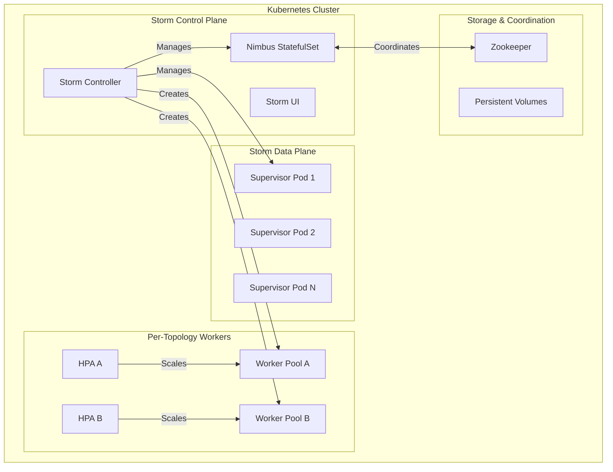

# Apache Storm Kubernetes Helm Chart

## Overview

This Helm chart deploys Apache Storm on Kubernetes with a comprehensive controller that manages Storm clusters, topologies, and worker pools through Custom Resource Definitions (CRDs). The chart provides production-ready Storm deployment with auto-scaling, monitoring, and lifecycle management.

## Features

- 🚀 **CRD-based Management**: Declarative Storm cluster and topology management
- 📊 **Comprehensive Metrics**: Prometheus-compatible metrics for monitoring
- ⚖️ **Auto-scaling**: HPA support for both supervisors and per-topology workers
- 🔄 **Lifecycle Management**: Automated topology submission, updates, and cleanup
- 🛡️ **Security**: RBAC, network policies, and pod security contexts
- 📈 **Monitoring**: Grafana dashboards and Prometheus ServiceMonitor
- 🎯 **Multi-tenancy**: Namespace-based isolation for different teams/environments

## Architecture



## Custom Resource Definitions

### StormCluster

Manages the core Storm infrastructure including Nimbus, Supervisors, and UI.

```yaml
apiVersion: storm.apache.org/v1beta1
kind: StormCluster
metadata:
  name: production-storm
  namespace: storm-system
spec:
  image:
    repository: apache/storm
    tag: "2.6.0"
    pullPolicy: IfNotPresent
  nimbus:
    replicas: 1
    resources:
      requests:
        cpu: 500m
        memory: 1Gi
      limits:
        cpu: 2000m
        memory: 2Gi
  supervisor:
    replicas: 3
    slotsPerSupervisor: 4
    deploymentMode: deployment  # or daemonset
  ui:
    enabled: true
    ingress:
      enabled: true
      hostname: storm.example.com
  zookeeper:
    enabled: true
  metrics:
    enabled: true
    serviceMonitor:
      enabled: true
```

### StormTopology

Defines a Storm topology with its deployment configuration.

```yaml
apiVersion: storm.apache.org/v1beta1
kind: StormTopology
metadata:
  name: wordcount-app
  namespace: storm-apps
spec:
  clusterRef: production-storm
  topology:
    name: wordcount
    jar:
      url: "https://repo1.maven.org/maven2/org/apache/storm/storm-starter/2.4.0/storm-starter-2.4.0.jar"
    mainClass: org.apache.storm.starter.WordCountTopology
    config:
      topology.workers: "3"
      topology.max.spout.pending: "1000"
  workers:
    replicas: 3
    resources:
      requests:
        cpu: 500m
        memory: 1Gi
      limits:
        cpu: 1000m
        memory: 2Gi
  autoscaling:
    enabled: true
    minReplicas: 2
    maxReplicas: 10
    metrics:
    - type: cpu
      target:
        averageUtilization: 70
```

### StormWorkerPool

Manages dedicated worker pools for specific topologies.

```yaml
apiVersion: storm.apache.org/v1beta1
kind: StormWorkerPool
metadata:
  name: wordcount-workers
  namespace: storm-apps
spec:
  topologyRef: wordcount-app
  clusterRef: production-storm
  replicas: 5
  template:
    spec:
      containers:
      - name: worker
        resources:
          requests:
            cpu: 500m
            memory: 1Gi
          limits:
            cpu: 1000m
            memory: 2Gi
```

## Installation

### Prerequisites

- Kubernetes 1.19+
- Helm 3.8+
- 4GB+ RAM available for Storm components
- Persistent storage (for Nimbus and Zookeeper)

### Install the Chart

```bash
# Add the Storm Helm repository
helm repo add storm https://apache.github.io/storm/helm-charts
helm repo update

# Install Storm with default values
helm install my-storm storm/storm-kubernetes \
  --namespace storm-system \
  --create-namespace

# Install with custom values
helm install my-storm storm/storm-kubernetes \
  --namespace storm-system \
  --create-namespace \
  --values custom-values.yaml
```

### Custom Values Example

```yaml
# custom-values.yaml
global:
  storageClass: "fast-ssd"

nimbus:
  replicaCount: 3  # HA mode
  persistence:
    size: 20Gi
  resources:
    requests:
      cpu: 1000m
      memory: 2Gi
    limits:
      cpu: 4000m
      memory: 4Gi

supervisor:
  replicaCount: 5
  autoscaling:
    enabled: true
    maxReplicas: 20

ui:
  ingress:
    enabled: true
    hostname: storm.company.com
    tls:
      enabled: true
      secretName: storm-tls

metrics:
  serviceMonitor:
    enabled: true
    interval: 15s

zookeeper:
  replicaCount: 3
  persistence:
    size: 10Gi
```

## Storm Controller

The Storm Controller is a Kubernetes operator that manages the lifecycle of Storm resources. It provides:

### Controller Features

- **Resource Reconciliation**: Continuously monitors and reconciles Storm resources
- **Topology Lifecycle**: Handles topology submission, updates, and cleanup
- **Auto-scaling**: Manages HPA for worker pools based on Storm metrics
- **Health Monitoring**: Tracks cluster and topology health status
- **Metrics Export**: Exports comprehensive metrics for monitoring

### Controller Metrics

The controller exports the following Prometheus metrics:

```
# Cluster metrics
storm_cluster_info{cluster,namespace,version}
storm_cluster_supervisors_total{cluster,namespace}
storm_cluster_slots_total{cluster,namespace,state}

# Topology metrics  
storm_topology_info{topology,namespace,cluster,status}
storm_topology_workers_total{topology,namespace,cluster}
storm_topology_executors_total{topology,namespace,cluster}
storm_topology_tasks_total{topology,namespace,cluster}
storm_topology_uptime_seconds{topology,namespace,cluster}

# Worker pool metrics
storm_worker_pool_replicas{pool,namespace,topology,state}

# Operation metrics
storm_topology_submissions_total{namespace,result}
storm_topology_deletions_total{namespace,result}

# Controller runtime metrics
controller_runtime_reconcile_time_seconds{controller}
controller_runtime_reconcile_errors_total{controller}
```

### Controller Configuration

```yaml
controller:
  enabled: true
  replicaCount: 1
  
  image:
    repository: apache/storm-controller
    tag: "v1beta1"
    pullPolicy: IfNotPresent
  
  resources:
    requests:
      cpu: 100m
      memory: 256Mi
    limits:
      cpu: 500m
      memory: 512Mi
  
  config:
    reconcileInterval: 30s
    workerLaunchTimeout: 300s
    topologySubmitTimeout: 120s
    logLevel: info
  
  metrics:
    enabled: true
    port: 8080
    serviceMonitor:
      enabled: true
```

## Monitoring

### Grafana Dashboard

The chart includes a comprehensive Grafana dashboard that displays:

- Storm cluster health and resource utilization
- Topology metrics (workers, executors, tasks, uptime)
- Worker pool scaling metrics
- Controller performance metrics
- Submission/deletion rates

Import the dashboard using the provided JSON configuration:

```bash
# Dashboard is available at /examples/grafana-dashboard.json
kubectl create configmap storm-dashboard \
  --from-file=dashboard.json=examples/grafana-dashboard.json \
  -n monitoring
```

### Prometheus Integration

Enable Prometheus monitoring with ServiceMonitor:

```yaml
metrics:
  serviceMonitor:
    enabled: true
    interval: 30s
    scrapeTimeout: 10s
    labels:
      prometheus: kube-prometheus
```

### Example Queries

```promql
# Average workers per topology
avg(storm_topology_workers_total) by (topology)

# Cluster resource utilization
sum(storm_cluster_slots_total{state="used"}) / sum(storm_cluster_slots_total{state="total"}) * 100

# Topology submission success rate
rate(storm_topology_submissions_total{result="success"}[5m])

# Controller reconciliation latency
histogram_quantile(0.95, rate(controller_runtime_reconcile_time_seconds_bucket[5m]))
```

## Topology Management

### Deploying a Topology

1. **Create the topology resource**:
```bash
kubectl apply -f my-topology.yaml
```

2. **Monitor the deployment**:
```bash
kubectl get stormtopology -n storm-apps
kubectl describe stormtopology wordcount-app -n storm-apps
```

3. **Check the status**:
```bash
kubectl get stormtopology wordcount-app -o yaml
```

### Scaling Workers

```bash
# Scale worker pool manually
kubectl patch stormworkerpool wordcount-workers \
  --type merge \
  -p '{"spec":{"replicas":10}}'

# Enable auto-scaling
kubectl patch stormtopology wordcount-app \
  --type merge \
  -p '{"spec":{"autoscaling":{"enabled":true,"maxReplicas":20}}}'
```

### Updating a Topology

```yaml
# Update topology configuration
spec:
  topology:
    config:
      topology.workers: "5"
      topology.max.spout.pending: "2000"
  lifecycle:
    updateStrategy: rolling  # or recreate
```

### Deleting a Topology

```bash
# Delete topology (controller handles Storm cleanup)
kubectl delete stormtopology wordcount-app -n storm-apps
```

## Security

### RBAC Configuration

The chart creates appropriate RBAC resources:

```yaml
serviceAccount:
  create: true
  name: storm-controller
  annotations: {}

rbac:
  create: true
  rules:
  - apiGroups: ["storm.apache.org"]
    resources: ["stormclusters", "stormtopologies", "stormworkerpools"]
    verbs: ["*"]
  - apiGroups: ["apps"]
    resources: ["deployments", "statefulsets"]
    verbs: ["*"]
  - apiGroups: ["autoscaling"]
    resources: ["horizontalpodautoscalers"]
    verbs: ["*"]
```

### Pod Security

```yaml
podSecurityContext:
  fsGroup: 1000
  runAsUser: 1000
  runAsNonRoot: true

containerSecurityContext:
  allowPrivilegeEscalation: false
  capabilities:
    drop: ["ALL"]
  readOnlyRootFilesystem: false
  runAsNonRoot: true
  runAsUser: 1000
```

### Network Policies

```yaml
networkPolicy:
  enabled: true
  ingress:
  - from:
    - namespaceSelector:
        matchLabels:
          name: monitoring
    ports:
    - port: 8080  # metrics
  - from: []  # Allow Storm internal communication
    ports:
    - port: 6627  # Nimbus
    - port: 6700-6710  # Supervisor slots
```

## Troubleshooting

### Common Issues

1. **Controller not starting**:
```bash
kubectl logs deployment/storm-controller -n storm-system
kubectl describe deployment storm-controller -n storm-system
```

2. **Topology stuck in Pending**:
```bash
kubectl describe stormtopology <name> -n <namespace>
kubectl logs deployment/storm-controller -n storm-system | grep <topology-name>
```

3. **Workers not scaling**:
```bash
kubectl get hpa -n <namespace>
kubectl describe hpa <topology-name>-workers-hpa -n <namespace>
```

4. **Nimbus connectivity issues**:
```bash
kubectl exec -it storm-nimbus-0 -n storm-system -- storm list
kubectl port-forward svc/storm-nimbus 6627:6627 -n storm-system
```

### Debug Commands

```bash
# Check all Storm resources
kubectl get stormclusters,stormtopologies,stormworkerpools -A

# Controller logs with error filtering
kubectl logs deployment/storm-controller -n storm-system | grep ERROR

# Storm cluster status
kubectl exec storm-nimbus-0 -n storm-system -- storm cluster-info

# Metrics endpoint
kubectl port-forward svc/storm-controller-metrics 8080:8080 -n storm-system
curl http://localhost:8080/metrics | grep storm_
```

## Examples

See the `examples/` directory for complete working examples:

- `basic-topology.yaml`: Simple word count topology
- `scaled-topology.yaml`: Auto-scaling topology with HPA
- `multi-tenant/`: Multi-namespace deployment
- `monitoring/`: Prometheus and Grafana configuration

## Development

### Building the Controller

```bash
cd storm-controller/
docker build -t apache/storm-controller:latest .
```

### Running Tests

```bash
# Unit tests
go test ./...

# Integration tests
./test/integration-test.sh

# E2E tests
./test/e2e-test.sh
```

### Contributing

1. Follow the Apache Storm contribution guidelines
2. Ensure all tests pass
3. Update documentation for new features
4. Add examples for new functionality

## Version Compatibility

| Chart Version | Storm Version | Kubernetes Version | Controller Version |
|---------------|---------------|-------------------|-------------------|
| 0.1.x         | 2.6.0         | 1.19+             | v1beta1           |
| 0.2.x         | 2.6.x         | 1.20+             | v1beta1           |

## Support

- 📖 **Documentation**: [Apache Storm Kubernetes Guide](https://storm.apache.org/kubernetes)
- 🐛 **Issues**: [GitHub Issues](https://github.com/apache/storm/issues)
- 💬 **Community**: [Apache Storm Mailing List](https://storm.apache.org/community.html)
- 📊 **Metrics**: See the monitoring/ directory for Prometheus and Grafana configurations

## License

Licensed under the Apache License, Version 2.0. See [LICENSE](LICENSE) for details.