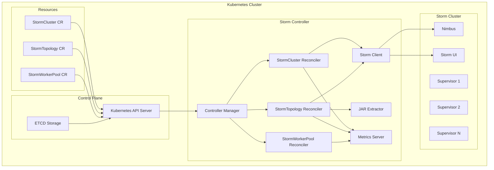
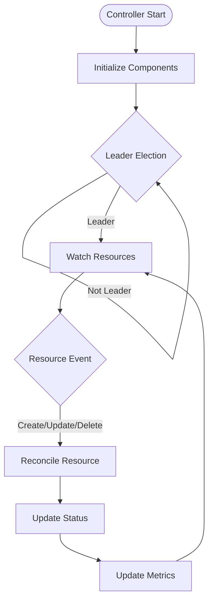
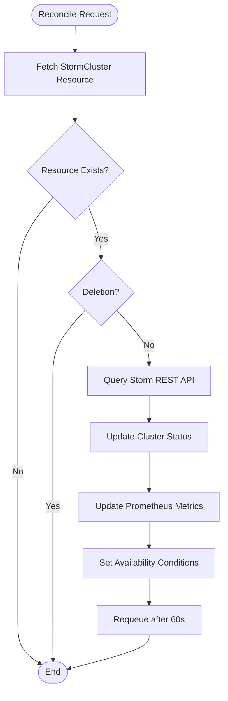
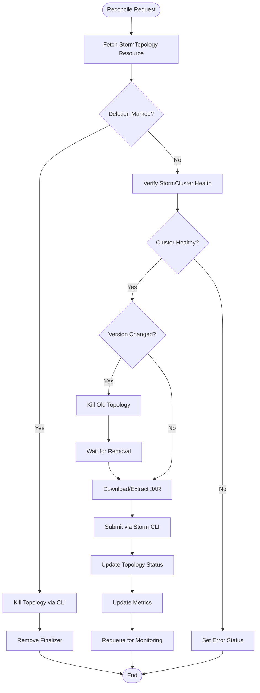
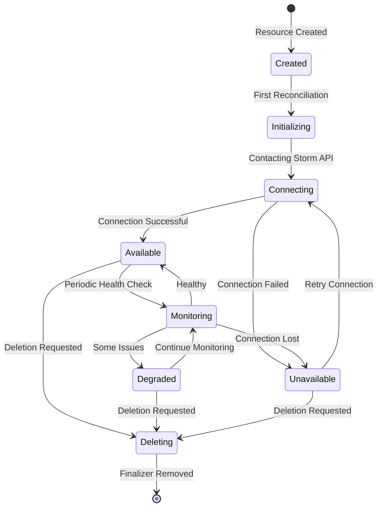
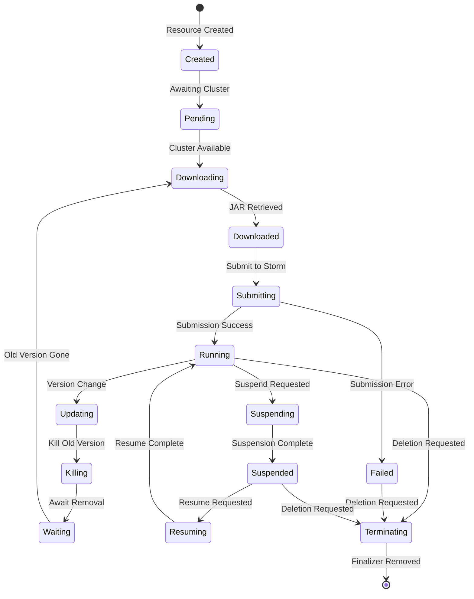
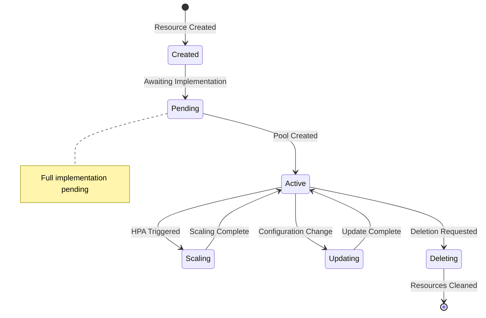
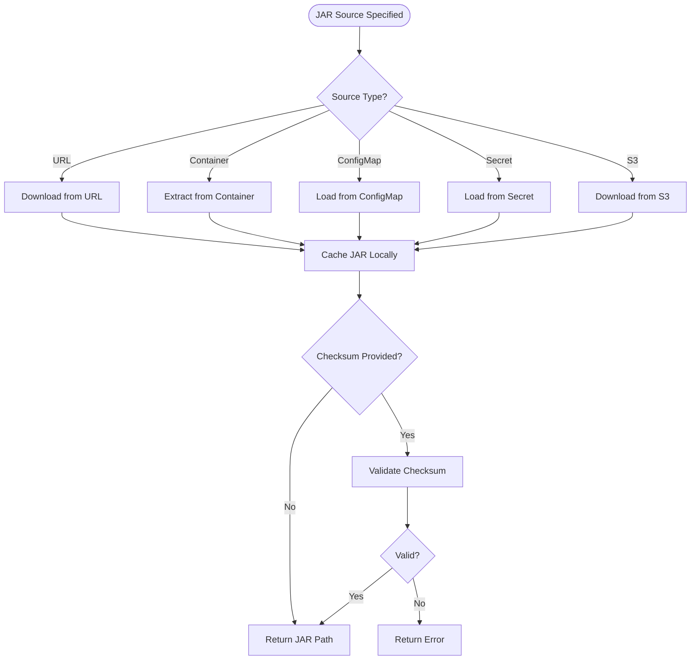
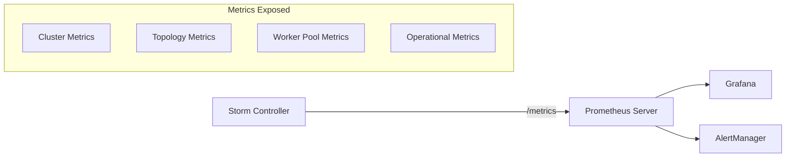
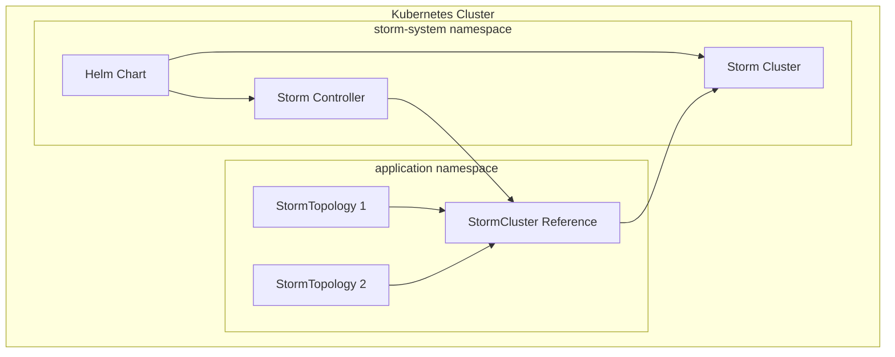

# Storm Kubernetes Controller Architecture

## Overview

The Storm Kubernetes Controller is a Kubernetes operator that manages Apache Storm topologies on Kubernetes. It follows the operator pattern to provide declarative management of Storm clusters and topologies through Custom Resource Definitions (CRDs).

The controller is designed to be **namespace-scoped**, meaning each controller instance manages a single Storm cluster within a specific namespace. This design enables multi-tenancy and simplified RBAC management.

## Architecture Components

### Custom Resource Definitions (CRDs)

The controller manages three primary resources:

1. **StormCluster** - Represents a reference to an existing Storm cluster deployment
2. **StormTopology** - Defines Storm topologies to be deployed on the cluster
3. **StormWorkerPool** - Manages dedicated worker pools for topologies (partial implementation)

### Controller Components



## Controller Workflow

### High-Level Controller Flow



### StormCluster Reconciliation Flow



### StormTopology Reconciliation Flow



## Resource State Diagrams

### StormCluster State Diagram



### StormTopology State Diagram



### StormWorkerPool State Diagram



## JAR Extraction Flow



## Key Design Decisions

### 1. Namespace-Scoped Architecture

The controller is designed to manage a single Storm cluster per namespace:

- **Isolation**: Each namespace can have its own Storm cluster
- **Multi-tenancy**: Different teams can manage their own clusters
- **RBAC**: Simplified permission management
- **Resource Limits**: Per-namespace resource quotas

### 2. Reference-Based Cluster Management

StormCluster resources don't create Storm infrastructure:

- **Flexibility**: Use any deployment method (Helm, manifests, operators)
- **Separation of Concerns**: Infrastructure vs. application management
- **Compatibility**: Works with existing Storm deployments

### 3. CLI-Based Topology Submission

Currently uses Storm CLI instead of Thrift API:

- **Simplicity**: Easier implementation and debugging
- **Compatibility**: Works with all Storm versions
- **Trade-off**: Less efficient than direct Thrift
- **Future**: Plans to migrate to Thrift API

### 4. Periodic Reconciliation

Regular status updates ensure eventual consistency:

- **Health Checks**: Every 60 seconds for clusters
- **Topology Monitoring**: Continuous state verification
- **External Changes**: Detects manual interventions

## Metrics and Observability

The controller exposes comprehensive Prometheus metrics:



### Metric Categories

1. **Cluster Metrics**
   - Supervisor count
   - Slot availability (total/used/free)
   - Cluster health status

2. **Topology Metrics**
   - Submission attempts/successes/failures
   - Running topology count
   - Version update frequency

3. **Worker Pool Metrics**
   - Pool size and utilization
   - Scaling events

4. **Operational Metrics**
   - Reconciliation duration
   - Error rates
   - API call latencies

## Security Considerations

### RBAC Requirements

The controller requires specific Kubernetes permissions:

```yaml
- apiGroups: ["storm.apache.org"]
  resources: ["stormclusters", "stormtopologies", "stormworkerpools"]
  verbs: ["get", "list", "watch", "create", "update", "patch", "delete"]
- apiGroups: ["batch"]
  resources: ["jobs"]
  verbs: ["create", "get", "list", "watch", "delete"]
- apiGroups: [""]
  resources: ["configmaps", "secrets", "pods"]
  verbs: ["get", "list", "watch"]
```

### Network Security

- Controller → Storm API: HTTP/HTTPS connections
- Topology submission: Via Storm CLI (requires network access to Nimbus)
- Metrics exposure: Secured endpoint for Prometheus scraping

## Limitations and Future Enhancements

### Current Limitations

1. **JAR Sources**: Limited to URLs and container images
2. **Authentication**: No built-in Storm authentication support
3. **Worker Pools**: Basic implementation only
4. **API Integration**: CLI-based instead of Thrift API
5. **Cluster Management**: Single cluster per controller

### Planned Enhancements

1. **Thrift API Integration**: Direct API calls for efficiency
2. **Advanced Worker Pools**: Full HPA and resource management
3. **Multi-Cluster Support**: Single controller managing multiple clusters
4. **Enhanced Security**: Storm authentication and authorization
5. **GitOps Integration**: Better support for declarative deployments

## Deployment Architecture



## Conclusion

The Storm Kubernetes Controller provides a cloud-native way to manage Apache Storm topologies on Kubernetes. Its architecture follows Kubernetes best practices while maintaining flexibility and extensibility. The namespace-scoped design and reference-based cluster management make it suitable for both simple deployments and complex multi-tenant environments.