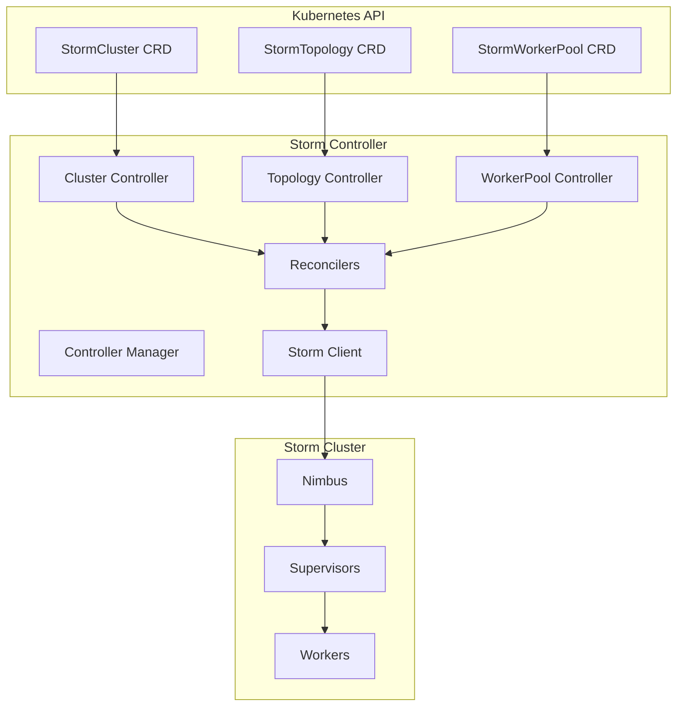

# Storm Kubernetes Controller Implementation Plan

## Overview

The Storm Kubernetes Controller will be a Kubernetes operator that watches and manages Storm CRDs (StormCluster, StormTopology, StormWorkerPool) to provide declarative management of Storm resources.

## Architecture



## Technology Stack

- **Language**: Go (using Kubebuilder/Operator SDK)
- **Framework**: controller-runtime
- **Storm Client**: Custom Go client for Storm Thrift API
- **Container Base**: Alpine Linux with JRE for storm-client

## Project Structure

```
storm-controller/
├── Dockerfile
├── Makefile
├── PROJECT
├── go.mod
├── go.sum
├── main.go
├── api/
│   └── v1alpha1/
│       ├── stormcluster_types.go
│       ├── stormtopology_types.go
│       ├── stormworkerpool_types.go
│       └── zz_generated.deepcopy.go
├── controllers/
│   ├── stormcluster_controller.go
│   ├── stormtopology_controller.go
│   └── stormworkerpool_controller.go
├── pkg/
│   ├── storm/
│   │   ├── client.go           # Storm Thrift client
│   │   ├── topology.go         # Topology management
│   │   └── metrics.go          # Metrics collection
│   ├── resources/
│   │   ├── deployment.go       # Worker deployments
│   │   ├── service.go          # Services
│   │   └── hpa.go             # HorizontalPodAutoscaler
│   └── utils/
│       ├── hash.go            # Resource hashing
│       └── status.go          # Status updates
└── config/
    ├── crd/                   # CRD manifests
    ├── rbac/                  # RBAC manifests
    ├── manager/               # Controller deployment
    └── samples/               # Sample CRs
```

## Implementation Steps

### Phase 1: Project Setup (Day 1)

1. **Initialize Project**
   - Use Kubebuilder to scaffold the project
   - Define API types for all three CRDs
   - Generate deepcopy methods

2. **Setup Development Environment**
   - Configure Makefile for building/testing
   - Setup Docker build pipeline
   - Configure GitHub Actions for CI

### Phase 2: Storm Client Development (Day 2-3)

1. **Thrift Client Implementation**
   ```go
   type StormClient interface {
       // Topology operations
       SubmitTopology(name string, jar []byte, config map[string]interface{}) error
       KillTopology(name string) error
       GetTopologyInfo(name string) (*TopologyInfo, error)
       GetClusterInfo() (*ClusterSummary, error)
       
       // Metrics operations
       GetTopologyMetrics(name string) (*TopologyMetrics, error)
   }
   ```

2. **JAR Management**
   - Download topology JARs from URLs
   - Cache JARs locally
   - Submit to Nimbus via Thrift

### Phase 3: Controller Implementation (Day 4-6)

1. **StormCluster Controller**
   - Watch StormCluster resources
   - Update cluster configuration
   - Manage rolling updates
   - Update status with cluster health

2. **StormTopology Controller**
   ```go
   func (r *StormTopologyReconciler) Reconcile(ctx context.Context, req ctrl.Request) (ctrl.Result, error) {
       // Get topology resource
       // Check if topology exists in Storm
       // Download JAR if needed
       // Submit/update topology
       // Create/update WorkerPool if needed
       // Update topology status
   }
   ```

3. **StormWorkerPool Controller**
   - Create worker Deployments
   - Configure HPA based on metrics
   - Manage worker scaling
   - Handle worker distribution

### Phase 4: Resource Management (Day 7-8)

1. **Worker Deployment Creation**
   ```go
   func createWorkerDeployment(topology *v1alpha1.StormTopology, pool *v1alpha1.StormWorkerPool) *appsv1.Deployment {
       // Create deployment with:
       // - Topology-specific configuration
       // - Resource limits from pool spec
       // - Node selectors/affinity
       // - Environment variables
   }
   ```

2. **HPA Configuration**
   - Create HPA for each worker pool
   - Configure custom metrics (pending slots, latency)
   - Set scaling policies

### Phase 5: Status and Monitoring (Day 9-10)

1. **Status Updates**
   - Topology state (ACTIVE, INACTIVE, KILLED, REBALANCING)
   - Worker allocation
   - Performance metrics
   - Error conditions

2. **Metrics Exposure**
   - Expose Prometheus metrics
   - Controller health metrics
   - Topology performance metrics

### Phase 6: Testing and Documentation (Day 11-12)

1. **Unit Tests**
   - Controller logic tests
   - Storm client tests
   - Resource generation tests

2. **Integration Tests**
   - End-to-end topology deployment
   - Scaling scenarios
   - Failure recovery

3. **Documentation**
   - API documentation
   - Usage examples
   - Troubleshooting guide

## Key Features to Implement

### 1. Topology Lifecycle Management

```yaml
apiVersion: storm.apache.org/v1alpha1
kind: StormTopology
metadata:
  name: wordcount
spec:
  jarUrl: "https://repo/storm-examples.jar"
  mainClass: "org.apache.storm.examples.WordCount"
  args: ["wordcount", "10"]
  config:
    topology.workers: 3
    topology.acker.executors: 2
  workerPool:
    replicas: 3
    resources:
      cpu: "1"
      memory: "2Gi"
```

### 2. Intelligent Scheduling

- Topology-aware scheduling
- Worker pool isolation
- Resource bin packing
- Anti-affinity for HA

### 3. Auto-scaling

```yaml
apiVersion: storm.apache.org/v1alpha1
kind: StormWorkerPool
metadata:
  name: wordcount-workers
spec:
  topologyName: wordcount
  minReplicas: 2
  maxReplicas: 10
  metrics:
  - type: Custom
    custom:
      metricName: storm_topology_pending_tuples
      targetValue: 1000
```

### 4. Zero-Downtime Updates

- Topology rebalancing during updates
- Graceful worker shutdown
- State preservation

### 5. Multi-tenancy

- Namespace isolation
- Resource quotas
- Priority classes

## Development Timeline

| Phase | Duration | Deliverables |
|-------|----------|--------------|
| Setup | 1 day | Project structure, CRD definitions |
| Storm Client | 2 days | Thrift client, JAR management |
| Controllers | 3 days | Three working controllers |
| Resources | 2 days | Deployment, Service, HPA creation |
| Status/Monitoring | 2 days | Status updates, metrics |
| Testing/Docs | 2 days | Tests, documentation |

**Total: 12 days**

## Technical Decisions

1. **Language**: Go for performance and Kubernetes ecosystem compatibility
2. **Framework**: Kubebuilder for standard operator patterns
3. **Storm Integration**: Direct Thrift API instead of REST
4. **Metrics**: Prometheus format for Kubernetes compatibility
5. **Topology Storage**: ConfigMaps for topology configs, URLs for JARs

## Questions to Resolve

1. **JAR Storage**: Should we support S3/GCS/Azure Blob in addition to HTTP?
2. **Authentication**: How to handle Storm cluster authentication?
3. **Topology Updates**: Support for rolling updates vs recreate?
4. **Resource Validation**: Should controller validate topology configs?
5. **Backup/Restore**: Should we support topology state backup?

## Next Steps

1. Create the controller project structure
2. Implement basic Storm Thrift client
3. Build StormTopology controller first (most critical)
4. Add worker pool management
5. Implement comprehensive testing
6. Create example topologies
7. Document deployment procedures